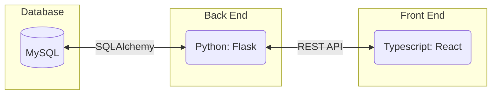

# Tutoring Session Scheduler

## Virgin Software
**Contributors:** Drew Glen, Carter Cavalier, Ben Amon-Kotey, Kobe Frimpong

### Abstract

The Tutoring Session Scheduler is designed to provide users with a simple interface which allows
students and parents to **schedule their _preferred_ tutors** and allows Tutoring Centers to **view,
confirm, and log meeting schedules.** 

### Specifcation

#### Tech Stack 

